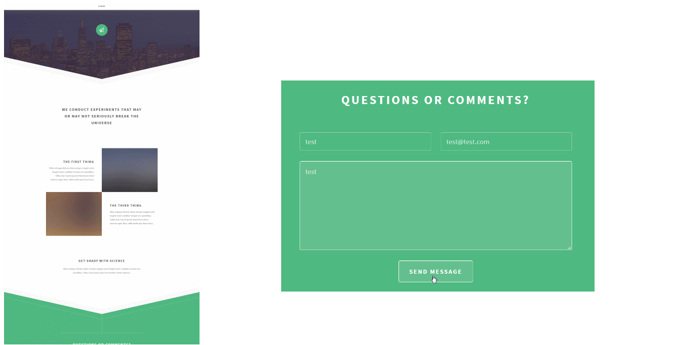

# NEBA Directive: a sample application for the NEBA framework for Apache Sling
This project demonstrates core concepts and features of the NEBA framework for Sling. 
It provides a demonstrative mini-CMS application for the beautiful responsive _directive_ template set by [http://html5up.net](http://html5up.net). 
The application was created as part of a presentation of the 2015 .adaptTo conference in Berlin, Germany.

## What this sample application is
This application demonstrates how NEBA can be used to model resources in Sling and use Spring's MVC features for Apache Sling.

## What this sample application is _not_ 
A ready-to-use CMS / web application. It has purely been designed to demonstrate NEBA features.
 
## How to run this application
1. If you don't have a Sling instance to experiment with, download the Sling 7 Standalone Application from the [official download page](https://sling.apache.org/downloads.cgi). Then, run the standalone jar using JDK 8 - this will install and start sling, e.g. with debugging on port 30303 using 
   `java.exe -agentlib:jdwp=transport=dt_socket,server=y,suspend=n,address=30303 -Xmx1700m -XX:MaxPermSize=256m -jar`. 
   Handy hint: Tail the error.log in sling/logs - this is the best way to see what is happening under the hood.
2. Install the NEBA Sling delivery bundle from [http://neba.io/download.html](http://neba.io/download.html), install and activate it.   
3. Clone this repo and run `mvn install sling:install` - this will install the application to a sling instance at localhost:8080
4. Open [http://localhost:8080/adaptto.html](http://localhost:8080/adaptto.html).
5. You may login with any sling user, e.g. using admin/admin for the default administrative account.